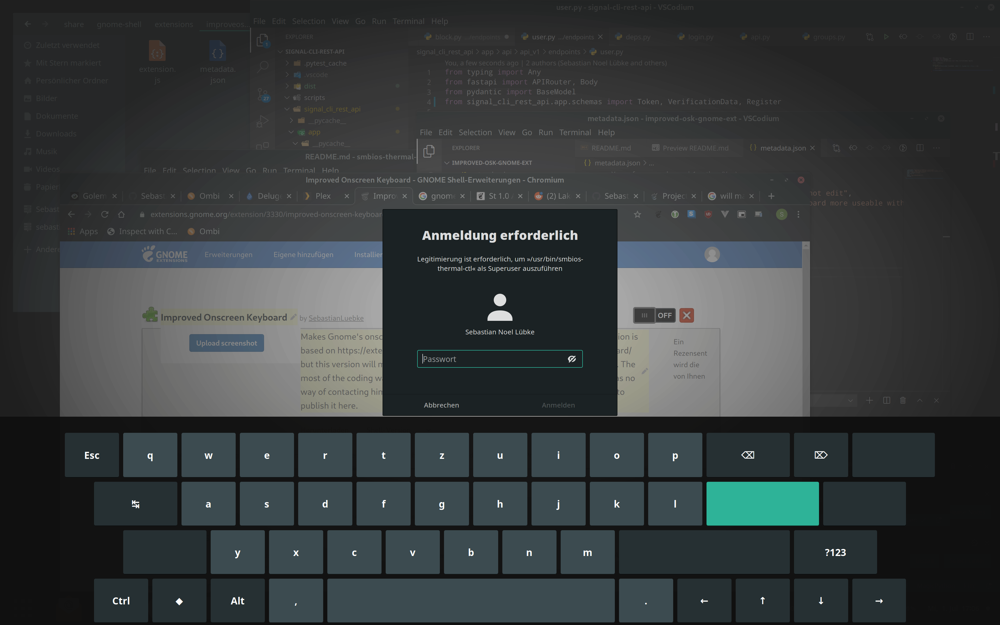

# improved-osk-gnome-ext

Makes Gnome's onscreen keyboard more useable with e.g. more keys

This extension is based on https://extensions.gnome.org/extension/1631/improve-onscreen-keyboard/ but this version will make the keyboard appear on the top layer of the gnome shell.

The most of the coding was done by schuhumi@extensions.gnome.org. Since there was no way of contacting him and i also didnt find any git repo for the extension i decided to publish it here.



## Installation

### From source code

Clone the git repo

```console
git clone https://github.com/SebastianLuebke/improved-osk-gnome-ext.git ~/.local/share/gnome-shell/extensions/improvedosk@luebke.io
```

reload gnome by pressing alt + F2 and enter r

### extensions.gnome.org

https://extensions.gnome.org/extension/3330/improved-onscreen-keyboard/


## FAQ

### some symbols are missing
the keyboard uses unicode characters, try install ttf-symbola on archlinux (AUR) or ttf-ancient-fonts-symbola on ubuntu/debian
